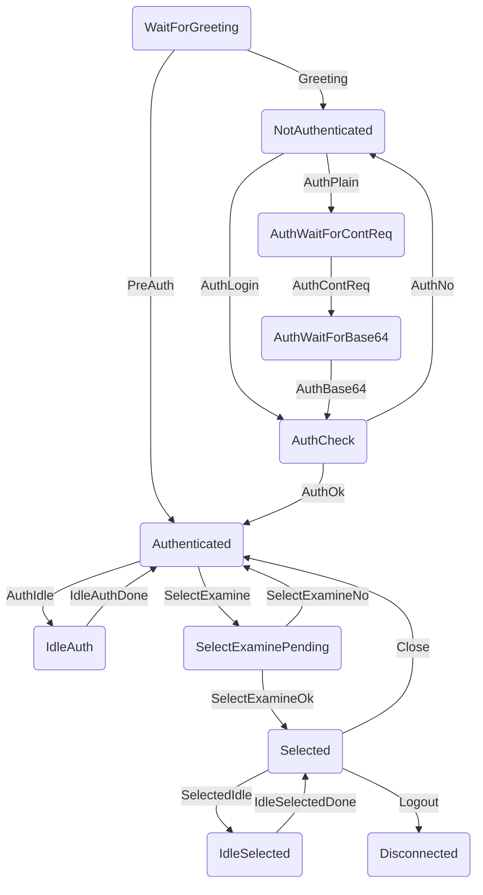

# ImapSuite

Die ImapSuite ist ein MitM-Proxy für Imap-Verbindungen. Es werden unverschlüsselte Verbindungen unterstützt:
<pre>
 ________               ___________             ____________
|        |             |           |           |            |
| Client |--TCP/10143--| ImapSuite |--TCP/143--| ImapServer |
|________|             |___________|           |____________|

   (Die Verbindungsparameter können konfiguriert werden.)

</pre>

Die Verbindungen werden grafisch dargestellt und können analysiert werden.
Das Tool ist in der Lage sowohl vom Client gesendete Commands, als auch vom Server gesendete Responses zu intercepten.
Die Nachrichten können dann RFC-konform verändert werden, bevor sie weitergeleitet werden.

## Usage

- mithilfe der requirements.txt sollte ein VirtualEnvironment mit python3-Interpreter erstellt werden

```bash
user@ubuntu:~/imap-suite$ virtualenv venv
user@ubuntu:~/imap-suite$ source venv/bin/activate
(venv) user@ubuntu:~/imap-suite$ pip install -r requirements.txt
```

- alternativ können die notwendigen Pakete in der requirements.txt nachgeschaut und manuell nachgeladen werden
- getestet wurde das Tool mit python3.7, python2 wird nicht unterstützt
- das root-Verzeichnis ist der src-Ordner, aus diesem sollte die ImapSuite.py ausgeführt werden

```bash
(venv) user@ubuntu:~/imap-suite$ cd src/
(venv) user@ubuntu:~/imap-suite$ python ImapSuite.py
```

## Parser
Als Parser wird ein Earley-Parser verwendet. Es werden folgende Imap-Capabilities unterstützt:
- Imap4rev1
- AUTH=PLAIN
- AUTH=LOGIN
- IDLE

Sollte der Server nicht unterstütze Capabilities senden, werden diese vom Proxy aus den entsprechenden Nachrichten gestript.

Die Auswahl des Earley-Parser basiert darauf, dass mit diesem Algorithmus sämtliche kontextfreie Grammatiken geparst werden können. Die in den RFCs gegebenen Grammatiken sind als kontextfreie Grammatiken angegeben. Bei speziellen Regeln ist jedoch keine kontextfreiheit gegeben (bspw. RFC 3501: literal = "{" number "}" CRLF *CHAR8 ; Number represents the number of CHAR8s; diese Regeln ist zwar in ihrer Definition kontextfrei, aufgrund des Kommentars müsste jedoch eine kontextsensitive Regel angewendet werden). Ebenfalls sind diverse Mehrdeutigkeiten in den gegebenen Grammatiken vorhanden, die vom Early-Parser allerdings unterstützt werden. Der Nachteil des Algorithmus ist die Laufzeit, die im Mittel O(n^3) beträgt, mit n als Länge des Eingabestrings. Imap ist jedoch kein zeitkritisches Protokoll, daher kann dieser Nachteil hingenommen werden.

Die gewählte Parsing Library ist lark-parser. Die Library unterstützt den Early-Alrgorithmus und das nachbearbeiten des Parsing-Trees. So kann beispielsweise die oben genannte kontextsensitive Regel nach dem Parsen überprüft werden.

## State-Machine
Für die Darstellung des nachfolgenden Diagramms ist mermaid notwendig.


## GUI
- Tab Parser
	- Diese Ansicht kann dazu genutzt werden, um händisch Nachrichten zu parsen.
	- Oben rechts muss die Start-Regel der Grammatik ausgewählt werden.
	- Sollte das Parsen zu lange dauern, kann man es abbrechen.
- Tab Proxy
	- Diese Ansicht steuert den MitM-Proxy
	- im oberen LineEdit-Feld muss die lokale Transportadresse angegeben werden, über die sich Clients zum Proxy verbinden sollen.
	- im unteren LineEdit-Feld muss die Transportadresse des Imap-Server angegeben werden.
	- Bevor der Proxy gestartet werden kann müssen die Einstellungen überprüft werden
		- der lokale Port muss frei sein
		- nach dem Verbindungsaufbau zur Transportadresse des Server muss der Server mit einem Imap-Greeting antworten
	- ist der Test erfolgreich, kann der Proxy gestartet werden
	- jede eingehende Verbindung wird in der Tabelle angezeigt
	- ein Doppelklick auf eine Verbindung öffnet ein Fenster mit weiteren Informationen und historischen Command/Response-Paaren
		- zusätzlich kann über dieses Fenster im Tab "New Command" ein Command in die bestehende Verbindung injected werden
		- die dazugehörige Response wird nicht an den Client weitergeleitet!
		- ist der Haken bei "Intercepted" gesetzt, werden eingehende Commands und Responses, bevor sie an den Parser weitergegeben werden, über ein zusätzlichen Fenster dem User zur Beabreitung angeboten.
	- Neue Verbindungen können werden direkt intercepted, wenn der Haken bei "Intercept new Connections" gesetzt ist.

## Development
- Informationen für Entwickler können src/README.md entnommen werden
